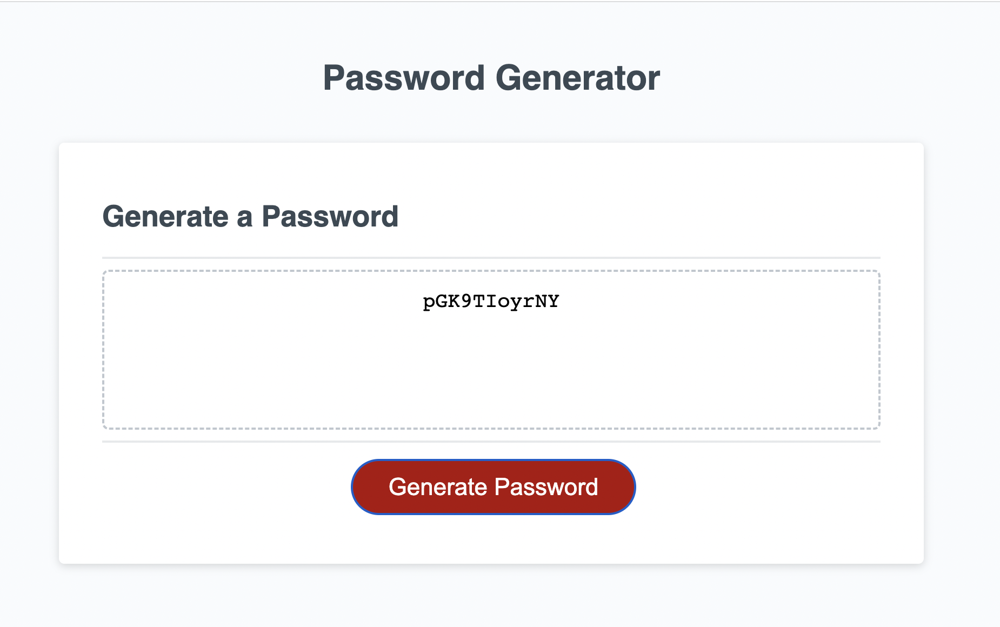

# Password-Generator
This application is a password generator created using HTML, JavaScript, and CSS files.
Through a series of prompts, you will be able to generate a password 8-128 characters in length and can include or exclude numbers, uppercase, lowercase, and special characters.
User will be able to click the red "generate password" button and be offered a series of prompts.
The first prompt will require the user to type in the length they want their password to be.
The next series of prompts will involve character-type questions with the option of "cancel" and "ok."
Clicking "cancel" indicates a "no" to the prompt offered and "ok" indicates a "yes."
Following the last prompt, a randomized password will be generated for the user.

